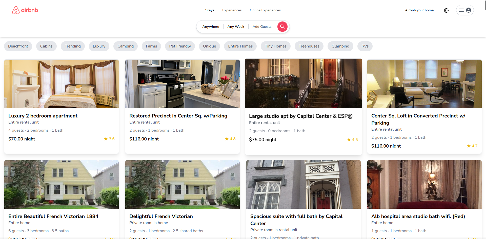
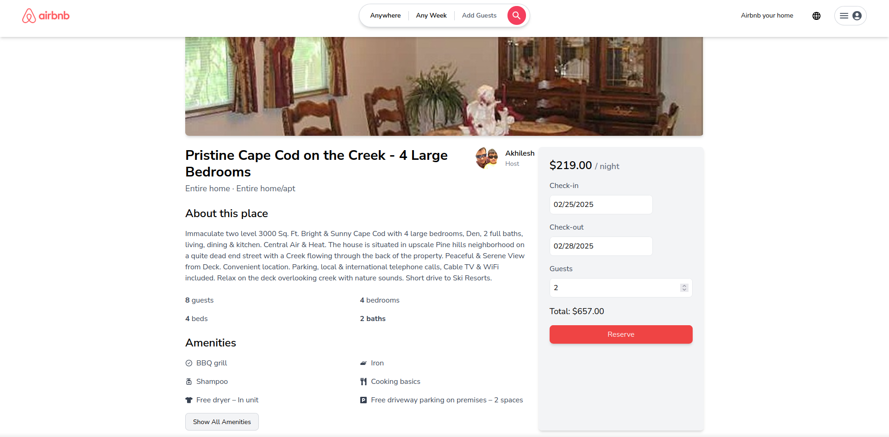
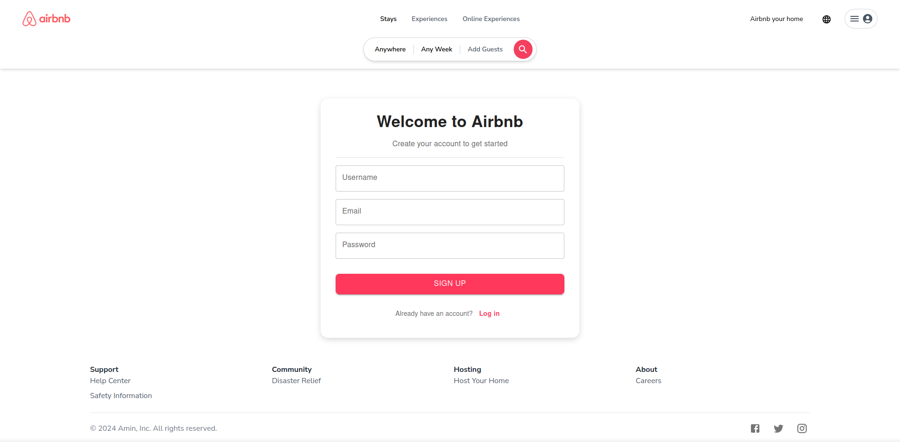

# Airbnb Clone

## Screenshots


<div style="display: flex; justify-content: space-between; align-items: center;">
  
  
  
</div>

## Setup Instructions

### Frontend Setup
1. Navigate to the project root directory.
2. Install dependencies:
   ```bash
   npm install
   ```
3. Start the development server: 
     ```bash
    npm run dev
    ```

### Backend Setup:

1. Navigate to the backend directory: 
    ```bash
   cd backend
   ```
2. Install dependencies: 
    ```bash
   npm install
   ```
3. Start the backend server: 
    ```bash
   node server.js
   ```